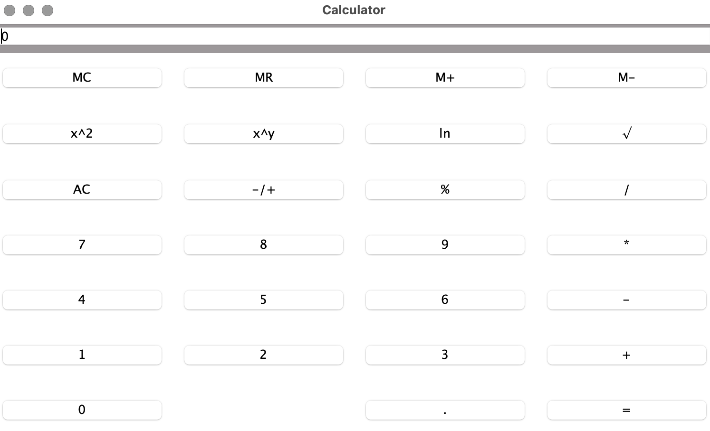

# Program Overview
---
- This is a basic calculator GUI program that has all then functionalities that a basic calculator should have such as:
    - Buttons for digits
    - Buttons for operations (unary and binary operations)
    - Buttons for memory functionality
- Visual: 

# How to Use
---
- You need to have java installed in order to run the compiled code
- Once you have java installed on your system, can simply run the program by running the file "CalculatorGUI.jar" located in "CalculatorGUI/out/artifacts/CalculatorGUI_jar"

# Additional Notes
---
- There is a test program to test the calculator (simulates clicking the buttons and analyzing the results)
- Can run the test program by running the `CalculatorGUI.jar` within the `CalculatorGUISampleTest_jar` directory
    - Ex(When terminal is opened in the CalculatorGUISampleTest_jar directory): Use the command: `java -jar CalculatorGUI.jar`